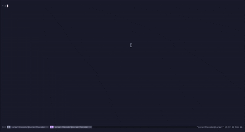

A blazing-fast CLI tool built in Go for downloading and mirroring websites locally. Features an interactive TUI, concurrent crawling, and intelligent asset rewriting.



## Motivation
I needed to extract the HTML, CSS, and JS files from a WordPress site to host them on a new platform for a client. Back when I used Windows, I would have used the HTTrack desktop app, but since switching to Linux, I couldn't find a tool that quite fit the bill. I decided to write my own tool instead—it seemed like a great learning experience.

## Features

- **Interactive TUI** - Beautiful terminal interface powered by [Bubble Tea](https://github.com/charmbracelet/bubbletea)
- **Concurrent Crawling** - Fast parallel downloads with sync.WaitGroup coordination
- **Smart Asset Handling** - Automatically rewrites CSS URLs and localizes all resources
- **Real-time Progress** - Live download progress with visual feedback
- **Flexible Interface** - Use interactive mode or CLI flags

## Quick Start

```bash
# Install with Go Toolchain 
go install github.com/ireoluwa12345/go-copier/cmd/go-copier@latest

go-copier
```

## Usage

```bash
Usage:
  go-copier [flags]

Flags:
  -h, --help            help for go-copier
  -o, --output string   Output directory (default ".")
  -u, --url string      URL to crawl
  -d, --depth int       Maximum crawl depth (default 1)
```
## Contributing
### Clone the repo

```bash
git clone https://github.com/ireoluwa12345/go-copier.git
cd go-copier
```

### Build the compiled binary

```bash
make build-cli
```

### Run the test suite

```bash
go test ./...
```

### Submit a pull request

If you'd like to contribute, please fork the repository and open a pull request to the `main` branch.

### Project Structure

```
go-copier/
├── cmd/cli/              # CLI entry point
│   ├── main.go          # Command handling
│   ├── tui.go           # Interactive prompts
│   └── spinner.go       # Progress UI
├── internal/
│   ├── copier/          # Main orchestration
│   ├── crawler/         # Web crawling logic
│   └── rewriter/        # Asset rewriting & download
├── pkg/css/urlextractor/ # CSS URL parsing
└── Makefile             # Build automation
```

### Dependencies

- [Cobra](https://github.com/spf13/cobra) - CLI framework
- [Bubble Tea](https://github.com/charmbracelet/bubbletea) - TUI framework
- [Lipgloss](https://github.com/charmbracelet/lipgloss) - Terminal styling
- [golang.org/x/net](https://golang.org/x/net) - HTML parsing

---

Built with Go and terminal magic.

**For Educational Purposes only!**
